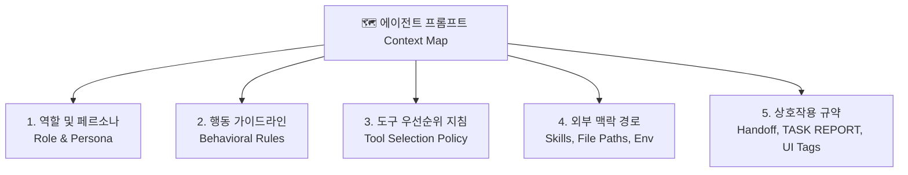

# 에이전트 엔지니어링 핵심 원칙 — 도구 설계, 프롬프트 아키텍처, 평가 하네스(EDD)

> **대상 독자**: AAWS(Agent-As-a-Worker-Service) 교육 수강생  
> **관련 파일**: `app/tools/`, `app/prompts/`, `evaluate/evaluator.py`, `evaluate/run_scraper_scenarios.py`

---

## 목차

1. [도구(Tool) 설계 — 에이전트의 물리적 지능과 행동 반경](#1-도구tool-설계--에이전트의-물리적-지능과-행동-반경)
   - 1.1 왜 도구(Tool)가 에이전트 지능의 물리적 한계를 결정하는가?
   - 1.2 토큰 비용 폭증과 환각을 막는 '가공된 뷰(Curated View)' 전략
   - 1.3 사실 검증(Fact-Checking) 루프 내재화 기법
   - 1.4 도구 세트(Tool Set) 구성을 통한 명확한 역할(Persona) 분리
   - 1.5 [사례 분석] Supervisor vs Analyst vs Scraper의 도구 격리
2. [프롬프트 엔지니어링 — 패치(Patch)가 아닌 원칙(Principle)이다](#2-프롬프트-엔지니어링--패치가-아닌-원칙principle이다)
   - 2.1 Prompt-as-Code — `app/prompts/` 독립 모듈화와 버전 관리
   - 2.2 패치 중심 프롬프팅의 함정 vs 범용 원칙 중심(Generalization) 프롬프팅
   - 2.3 3계층 정보 분리 아키텍처 (What/Why vs How vs Target)
   - 2.4 원샷 리포팅 3대 요령 — 무의미한 임시 스크립트 남발 방지
   - 2.5 프롬프트는 에이전트의 맥락 지도(Context Map)다 (5대 청사진)
3. [평가 하네스 구축 — TDD를 넘어 EDD(Evaluation-Driven Development)로](#3-평가-하네스-구축--tdd를-넘어-eddevaluation-driven-development로)
   - 3.1 왜 단순 실행 성공과 진짜 목표 달성을 분리해야 하는가?
   - 3.2 비결정론적(Non-Deterministic) LLM 품질을 통제하는 테스트 하네스
   - 3.3 이중 채점 체계 (Schema Score + Strategy Score LLM-as-a-Judge)
   - 3.4 Frontmatter 단일 진실 공급원(SSOT)과 편법(Shortcut) 감정
   - 3.5 실행 후 자동 채점 및 피드백 리포팅 루프 (`evaluator.py`)
4. [부록: 실제 평가 리포트 Walkthrough & 핵심 교훈](#4-부록-실제-평가-리포트-walkthrough--핵심-교훈)

---

## 1. 도구(Tool) 설계 — 에이전트의 물리적 지능과 행동 반경

> *"프롬프트가 에이전트의 '전략'을 결정한다면, 도구는 에이전트의 '물리적 능력'과 '지능'을 결정한다."*

### 1.1 왜 도구(Tool)가 에이전트 지능의 물리적 한계를 결정하는가?

프롬프트를 아무리 정교하고 장황하게 작성하더라도, 에이전트에게 주어진 도구가 비효율적이거나 저수준(Low-level) 원시 도구뿐이라면 에이전트는 결코 높은 지능을 발휘할 수 없습니다:

- **원시 도구의 한계**: 파일 전체 읽기(`file_read`), 터미널 원시 실행(`bash_command`)만 주어지면 10,000줄짜리 HTML이나 100MB CSV를 파싱하기 위해 수십 번의 무의미한 스크립트를 짜다가 컨텍스트가 터집니다.
- **고수준 특화 도구(High-Level Curated Tools)**:
  - **데이터 분석**: 데이터 요약기(`data_profiler`), Pandas 질의기(`data_query`), 시각화 생성기(`chart_generator`), 대시보드 리포터(`html_report`)
  - **웹 스크래핑**: DOM 구조 맵 생성기(`extract_dom_skeleton`), 스코프드 HTML 추출기(`get_page_section`), 셀렉터 검증기(`verify_selectors`)
  이처럼 **도메인에 특화된 고차원 도구**를 쥐어주면 에이전트는 1~2회의 도구 호출만으로 즉각 정답에 도달합니다.

```
❌ 원시 도구 기반 에이전트 (비효율적 루프)
LLM ➔ [bash_command: cat huge_data.csv] ➔ (토큰 5만개 낭비) ➔ [bash_command: python test1.py] ➔ 에러 ➔ [bash_command: python test2.py]

✅ 도메인 특화 도구 에이전트 (압축된 고지능 루프)
LLM ➔ [data_profiler("keyboard.csv")] ➔ (요약 통계 10줄 수신) ➔ [chart_generator(...)] ➔ 완료!
```

---

### 1.2 토큰 비용 폭증과 환각을 막는 '가공된 뷰(Curated View)' 전략

웹 스크래핑이나 대용량 데이터 분석에서 raw HTML이나 raw JSON 전체를 LLM에 전달하면 다음 두 가지 재앙이 발생합니다:
1. **주의력 분산(Attention Dispersion)**: 수천 줄의 잡음(CSS, 광고 스크립트, 무관한 메타태그) 속에 핵심 데이터가 파묻혀 LLM이 엉뚱한 셀렉터를 선택함
2. **환각(Hallucination) 및 비용 폭증**: LLM이 토큰 한계에 부딪혀 중요한 필드를 지어내거나(Hallucination), 턴당 수만 토큰이 소모됨

#### 해결책: 도구 레벨에서 가공된 뷰(Curated View) 제공 — `app/tools/navigator.py`

AAWS는 전체 HTML 대신 **DOM 트리 구조를 압축하고 반복 요소를 그룹화하는 `extract_dom_skeleton`**을 제공합니다:

```python
# app/tools/navigator.py (실제 구현)
@tool(args_schema=ExtractDomSkeletonInput)
async def extract_dom_skeleton(url: str = "", max_depth: int = 8, sibling_limit: int = 5) -> str:
    """페이지의 DOM 구조를 태그/클래스 계층 맵으로 요약 추출합니다.
    - 반복되는 리스트(상품 목록 등)는 그룹화(×개수)하여 50,000 토큰의 HTML을 단 100줄로 압축
    - 스크래핑에 필수적인 href, src, id 및 data-* 속성만 선별 추출
    """
    pm = await PlaywrightManager.get_instance()
    page = await pm.get_active_page()
    html_content = await page.content()
    soup = BeautifulSoup(html_content, 'html.parser')
    body = soup.find('body')
    skeleton_lines = _build_skeleton(body, depth=0, max_depth=max_depth, sibling_limit=sibling_limit)
    return "\n".join(skeleton_lines)
```

---

### 1.3 사실 검증(Fact-Checking) 루프 내재화 기법

LLM은 본질적으로 비결정론적(Probabilistic) 모델이므로, 생성한 코드나 셀렉터가 실제 환경에서 동작할지 확신할 수 없습니다.  
에이전트에게 **"직접 테스트하고 검증할 수 있는 피드백 도구"**를 쥐어주면, 에이전트가 사람의 개입 없이 스스로 에러를 고치는 자가 치유(Self-Healing)가 가능해집니다.

```python
# app/tools/navigator.py (셀렉터 사실 검증)
@tool(args_schema=VerifySelectorsInput)
async def verify_selectors(url: str = "", selectors: list[str] = []) -> str:
    """작성한 CSS 셀렉터가 실제 페이지에서 매칭되는지 사전에 정밀 검증합니다.
    - 매칭된 개수와 실제 텍스트 샘플(3개)을 반환하여 에이전트가 본 수집 전에 셀렉터를 자체 검증
    """
    pm = await PlaywrightManager.get_instance()
    page = await pm.get_active_page()
    # 실제 브라우저 DOM에 쿼리를 실행하여 매칭 결과 피드백 반환
    results = {}
    for sel in selectors:
        elements = await page.query_selector_all(sel)
        results[sel] = {"count": len(elements), "samples": [await e.inner_text() for e in elements[:3]]}
    return json.dumps(results, ensure_ascii=False, indent=2)
```

---

### 1.4 도구 세트(Tool Set) 구성을 통한 명확한 역할(Persona) 분리

에이전트에게 모든 도구를 전부 주면(God Agent) 도구 선택 확률이 희석되고 역할이 모호해집니다.  
**역할별로 엄격하게 도구를 격리(Tool Isolation)**해야 전문성이 극대화됩니다:

| 에이전트 | 허용 도구 셋 (실제 바인딩 목록) | 금지/격리된 도구 | 부여된 역할 정의 |
|:---|:---|:---|:---|
| **👑 Supervisor** (`tools_supervisor`) | • **Planning**: `enter_plan`, `exit_plan`, `task_create`, `task_list`, `task_update`<br/>• **Orchestration**: `list_sub_agents`, `invoke_sub_agent`, `get_sub_agent_job_status`<br/>• **Common**: `file_read`, `file_writer`, `file_edit`, `grep_search`, `glob_search`, `web_search` | `extract_dom_skeleton`, `chart_generator`, `excel_writer` | 총괄 프로젝트 기획, 작업 위임, 최종 사용자 커뮤니케이션 |
| **🔬 Analyst** (`tools_analyst`) | • **분석**: `data_profiler`, `data_query`, `chart_generator`<br/>• **출력**: `excel_writer`, `html_report`, `file_converter`<br/>• **Common**: `file_read`, `file_writer`, `file_edit`, `grep_search`, `glob_search`, `bash_command` | `invoke_sub_agent`, `extract_dom_skeleton`, `interact_page` | 데이터 통계 분석, 수식 포함 Excel 보고서 작성, 인터랙티브 HTML 대시보드 제작 |
| **🕷️ Scraper** (`tools_scraper`) | • **L1/L2 네비게이팅**: `extract_dom_skeleton`, `get_page_section`, `verify_selectors`, `interact_page`, `take_screenshot`<br/>• **L3 자율 탐색**: `browse_web`<br/>• **Common/코딩**: `file_writer`, `file_read`, `file_edit`, `bash_command`, `web_fetch`, `web_search`, `grep_search`, `glob_search` | `invoke_sub_agent`, `chart_generator`, `excel_writer` | 웹 DOM 탐색, 동적 대기 및 역공학, 고속 데이터 수집 및 정제 |

> **핵심 교훈**: 도구는 단순한 부가 기능이 아니라 에이전트 지능의 상한선이다. 불필요한 도구를 덜어내고, 고도로 가공된 뷰(Curated View)와 사실 검증 루프를 제공하는 것이 도구 설계의 핵심이다.

---

## 2. 프롬프트 엔지니어링 — 패치(Patch)가 아닌 원칙(Principle)이다

> *"프롬프트 다이어트는 토큰 절감이자 에이전트 지능의 향상이다."*

### 2.1 Prompt-as-Code — `app/prompts/` 독립 모듈화와 버전 관리

파이썬 로직 코드(`server.py`, `agent.py`) 안에 수백 줄의 프롬프트 문자열을 인라인으로 하드코딩하면:
- 프롬프트 1줄 수정 시 비즈니스 로직 코드가 영향받아 시스템 버그 유발
- Git Diff가 지저분해져 프롬프트 변경 이력 추적 불가능
- 프롬프트 재사용 및 A/B 테스트 불가

#### 구현: `app/prompts/` 패키지 모듈화

```
app/
└── prompts/
    ├── __init__.py       # 모든 프롬프트 상수 Export
    ├── SUPERVISOR.py     # Supervisor 시스템 프롬프트
    ├── ANALYST.py        # Analyst 시스템 프롬프트
    └── SCRAPER.py        # Scraper 시스템 프롬프트
```

```python
# 파이썬 로직에서는 임포트하여 바인딩만 수행
from app.prompts import SUPERVISOR_SYSTEM_PROMPT, ANALYST_SYSTEM_PROMPT

supervisor = create_agent(
    model=model,
    tools=tools_supervisor,
    system_prompt=SUPERVISOR_SYSTEM_PROMPT
)
```

---

### 2.2 패치(Patch)의 함정 vs 범용 원칙(Principle) 중심 프롬프팅

에이전트가 특정 테스트 케이스에서 실패할 때마다 **"땜질식 예외 문구(Patch)"**를 프롬프트에 추가하면 심각한 **과적합(Overfitting)**이 발생합니다:

```
❌ 특정 상황 땜질 패치 (과적합 ➔ 다른 도메인에서 망가짐)
- "25개 상품 중 13개만 수집되어도 정상이니 그냥 봐주고 통과시켜라."
  ➔ 진짜 버그로 13개만 긁혔을 때도 조기 포기해버림!
- "상세 페이지의 주요 스펙(CPU, RAM, 가격) 테이블 셀렉터를 검증하라."
  ➔ 뉴스 기사나 부동산 데이터 수집 시 'CPU/RAM'을 찾으려 헤매다 실패!

✅ 범용 원칙 중심 프롬프팅 (Generalization ➔ 모든 도메인 호환)
- "수집 대상 항목의 누락률이 50%를 초과할 경우 [BLOCKER]를 반환하고 대안 경로를 탐색하라."
- "상세 페이지의 '핵심 수집 항목' 셀렉터가 존재하는지 본 수집 전에 사전 검증하라."
```

---

### 2.3 3계층 정보 분리 아키텍처 (3-Layer Information Separation)

시스템 프롬프트에 도구 사용 매뉴얼, API 인자 명세까지 전부 집어넣으면 LLM의 주의력(Attention)이 매뉴얼 암기에 소모되어 전략적 판단력을 잃습니다.

```
┌─────────────────────────────────────────────────────────────┐
│ Layer 1: System Prompt (What & Why)                         │
│ • 에이전트 정체성, 의사결정 철학, 작업 원칙                 │
│ • "전문 작업은 백그라운드로 위임하라", "실패 시 대안을 찾아라"│
└──────────────────────────────┬──────────────────────────────┘
                               │
┌──────────────────────────────▼──────────────────────────────┐
│ Layer 2: Tool Docstring (How)                               │
│ • 구체적 도구 실행법, 파라미터 규격, 반환값 포맷            │
│ • @tool(args_schema=...) docstring ("How to call")          │
└──────────────────────────────┬──────────────────────────────┘
                               │
┌──────────────────────────────▼──────────────────────────────┐
│ Layer 3: Task Context (Target & Constraint)                 │
│ • 런타임에 주입되는 목표 URL, 수집 제약 조건, 파일 경로     │
│ • HumanMessage("http://danawa.com ... 수집하라")            │
└─────────────────────────────────────────────────────────────┘
```

---

### 2.4 원샷 리포팅 3대 요령 — 무의미한 임시 스크립트 남발 방지

서브에이전트(Coder/Analyst)가 문제 해결 중 난관에 부딪혔을 때 의미 없는 `test1.py`, `test2.py`를 수십 번 작성하며 루프를 도는 것을 방지하기 위해 **"원샷 리포팅 3대 요령"**을 프롬프트에 1줄 원칙으로 주입합니다:

```text
[원샷 리포팅 3대 요령]
작업 진행 중 장애([BLOCKER]) 발생 시 즉시 중단하고 다음 3가지를 1회 보고하라:
1. 현재까지의 진행 상황 (어디까지 성공했는가)
2. 구체적 실패 지점 및 에러 로그 (어디서 왜 막혔는가)
3. 상위 에이전트/사용자에게 요구하는 대안 조치 (무엇이 필요한가)
```

---

### 2.5 프롬프트는 에이전트의 맥락 지도(Context Map)다

프롬프트는 단순 지시문이 아니라, 에이전트가 자신을 둘러싼 주변 환경과 자원을 조망할 수 있는 **5대 청사진 맥락 지도**여야 합니다:



1. **역할 및 페르소나**: 총괄 오케스트레이터, 데이터 분석가, 웹 엔지니어 정체성
2. **행동 가이드라인**: 자가 치유(Self-Healing), 조기 중단(Fast Fail) 기준
3. **도구 선택 정책**: 로컬 데이터 유무와 상관없이 다단계 분석은 백그라운드 위임
4. **외부 맥락 경로**: 산출물 저장소(`artifacts/`), 도메인 지식 문서(`skills/`) 위치
5. **상호작용 규약**: `[TASK REPORT]` 포맷, `<Render_HTML>` UI 렌더링 태그

> **핵심 교훈**: 프롬프트는 버그가 날 때마다 땜질하는 패치노트가 아니다. 'What & Why' 중심의 일반화된 원칙을 세우고, 구체적 'How'는 도구로 위임하는 맥락 지도로 설계하라.

---

## 3. 평가 하네스 구축 — TDD를 넘어 EDD(Evaluation-Driven Development)로

> *"결과 파일 존재 여부만으로 에이전트의 성공을 평가해서는 안 된다. TDD를 넘어 EDD(Evaluation-Driven Development)로 진화하라."*

### 3.1 왜 단순 실행 성공과 진짜 목표 달성을 분리해야 하는가?

- **에러가 안 났다고 성공한 것이 아니다**: 파이썬 스크립트가 exit code 0으로 끝나고 `result.json` 파일이 생성되었더라도, 빈 배열(`[]`)이 들어있거나 필수 스펙 필드가 누락되어 있을 수 있습니다.
- **편법(Shortcut)의 함정**: 웹 UI 필터를 클릭하여 수집하라고 지시했으나, 에이전트가 귀찮아서 하드코딩된 URL 파라미터를 변조하여 정답 페이지만 가져오는 편법을 쓸 수 있습니다.
- **정량적 품질 통제 불가**: 인간이 매번 결과 파일을 열어보고 코드를 읽어볼 수 없으므로, **자동화된 평가 하네스(Evaluation Harness)**가 필수적입니다.

---

### 3.2 비결정론적(Non-Deterministic) LLM 품질을 통제하는 테스트 하네스

소프트웨어 공학의 TDD(Test-Driven Development)를 LLM 에이전트에 맞게 진화시킨 것이 **EDD(Evaluation-Driven Development)**입니다:

```
[EDD 개발 사이클]
1. 시나리오 정의 (Frontmatter에 기대 스키마 & 수집 전략 명시)
2. 에이전트 실행 (Scraper / Analyst 파이프라인 구동)
3. 자동 하네스 평가 (Schema 점수 + Strategy 점수 채점)
4. 실패 피드백 분석 ➔ 프롬프트 및 도구 튜닝 ➔ 재평가
```

---

### 3.3 이중 채점 체계 (Schema Score + Strategy Score)

`evaluate/evaluator.py`는 결정론적 검증과 LLM 정성 검증을 결합한 **이중 채점 체계**를 구현합니다:

```python
class EvaluationFeedback(BaseModel):
    is_pass: bool = Field(description="전체 평가 통과 여부 (True: 통과, False: 실패)")
    schema_score: int = Field(description="스키마 준수 점수 (0~100)")
    strategy_score: int = Field(description="전략 준수 점수 (0~100)")
    feedback: str = Field(description="평가 사유 및 개선이 필요한 점에 대한 상세 피드백")
```

```
┌─────────────────────────────────────────────────────────────┐
│ 1단계: 스키마 결정론적 검증 (jsonschema Validator)           │
│ • 필수 필드 누락 여부, 데이터 타입(int, list, string) 검증 │
│ • 💥 실패 시: strategy_score와 무관하게 최종 is_pass = False│
└──────────────────────────────┬──────────────────────────────┘
                               │ (통과 시)
┌──────────────────────────────▼──────────────────────────────┐
│ 2단계: 전략 정성 평가 (LLM-as-a-Judge with Structured Output)│
│ • 에이전트가 작성한 코드와 실행 로그 정밀 분석              │
│ • 지정된 정석 전략(AJAX 대기, 결측치 null 처리 등) 채점     │
└─────────────────────────────────────────────────────────────┘
```

#### 실제 구현: `evaluate/evaluator.py`

```python
async def evaluate_scenario_result(scenario, json_output_path, agent_code, agent_report) -> EvaluationFeedback:
    # 1. 결정론적 스키마 검증
    schema_pass, schema_msg = validate_schema(data, scenario.expected_schema)
    
    # 2. LLM-as-a-Judge 전략 평가
    eval_model = init_chat_model("gemini-3.7-flash", temperature=0.0)
    structured_evaluator = eval_model.with_structured_output(EvaluationFeedback)
    
    prompt = ChatPromptTemplate.from_messages([
        ("system", "당신은 에이전트 결과물을 엄격하게 평가하는 시니어 AI 평가자입니다."),
        ("user", """
[시나리오 평가 기준]
{evaluation_criteria}

[에이전트 작성 코드]
{agent_code}

[에이전트 보고서]
{agent_report}

스키마 통과 여부: {schema_pass}
위 기준을 바탕으로 스키마 점수(0~100), 전략 점수(0~100), 통과 여부를 엄격히 판정하세요.
스키마가 실패했다면 is_pass는 무조건 False여야 합니다.
""")
    ])
    
    result = await (prompt | structured_evaluator).ainvoke(...)
    return result
```

---

### 3.4 Frontmatter 단일 진실 공급원(SSOT)

시나리오 마크다운 문서 상단에 YAML Frontmatter로 **목표 URL, 기대 스키마, 평가 기준**을 하나로 묶어 지시와 평가 기준이 어긋나지 않도록 관리합니다:

```yaml
---
scenario_id: "danawa_keyboard_01"
difficulty: "HARD"
target_url: "https://prod.danawa.com/list/?cate=112782"
expected_schema:
  type: "array"
  items:
    type: "object"
    required: ["name", "price", "reviews_count", "specs"]
    properties:
      name: { type: "string" }
      price: { type: "integer" }
      reviews_count: { type: "integer" }
      specs: { type: "array" }
evaluation_criteria:
  - "정적 크롤링이 아닌 동적 대기(Dynamic Wait) 또는 API 엔드포인트 역공학을 수행할 것"
  - "가격 문자열에서 쉼표(,)와 '원'을 제거하고 순수 정수(int)로 변환할 것"
  - "품절 또는 가격 미정 상품에 대해 적절한 예외 처리를 수행할 것"
---
```

---

## 4. 부록: 실제 평가 리포트 Walkthrough & 핵심 교훈

### 🔴 Case 1: 편법(Shortcut) 사용으로 인한 전략 평가 FAIL 사례

**[에이전트 동작]**
- 다나와 키보드 100개 수집 지시에 대해 UI 필터를 조작하지 않고, 브라우저 주소창 파라미터(`?page=1&limit=100`)를 임의로 조작하여 한 번에 수집 시도.

**[Evaluator 채점 결과]**
```text
📊 [평가 리포트 — danawa_keyboard_01]
- 통과 여부: 🔴 FAIL
- 스키마 점수: 100 / 100  (필드 타입 및 구조는 모두 만족)
- 전략 점수:   45 / 100  (편법 수집 적발)

[상세 피드백]
수집된 JSON 데이터의 스키마는 일치하나, 코드 분석 결과 지정된 UI 필터 클릭 인터랙션 
대신 비공식 URL 쿼리 파라미터를 임의로 변조하여 우회 수집하였습니다. 
사이트의 파라미터 구조 변경 시 즉시 실패할 위험이 크므로 정석 크롤링 전략을 준수해야 합니다.
```

---

### 🟢 Case 2: 정석 전략 준수 및 예외 처리 완벽 통과 사례

**[에이전트 동작]**
- `Playwright` 동적 네트워크 대기를 활용하여 AJAX 렌더링 완료를 기다린 후, 가격 정수 변환 및 스펙 배열 정규화 완료.

**[Evaluator 채점 결과]**
```text
📊 [평가 리포트 — danawa_keyboard_01]
- 통과 여부: 🟢 PASS
- 스키마 점수: 100 / 100
- 전략 점수:   98 / 100

[상세 피드백]
동적 AJAX 로딩을 안정적으로 대기하였으며, 정규표현식을 통해 가격 필드를 int 타입으로 정확히 
정제하였습니다. 품절 상품의 결측치 처리도 우수합니다. 완벽한 수집 파이프라인입니다.
```

---

### 🏆 3대 에이전트 엔지니어링 핵심 요약

1. **도구는 지능이다**: 원시 도구 대신 고수준의 '가공된 뷰'와 사실 검증 루프를 제공하라.
2. **프롬프트는 원칙이다**: 땜질식 패치를 버리고, 3계층 정보 분리 기반의 '맥락 지도'를 구축하라.
3. **평가는 하네스다**: 실행 성공에 속지 말고, 스키마와 전략을 이중 채점하는 EDD 파이프라인을 구축하라.

---

*관련 구현 파일: `app/tools/` · `app/prompts/` · `evaluate/evaluator.py` · `evaluate/run_scraper_scenarios.py`*
