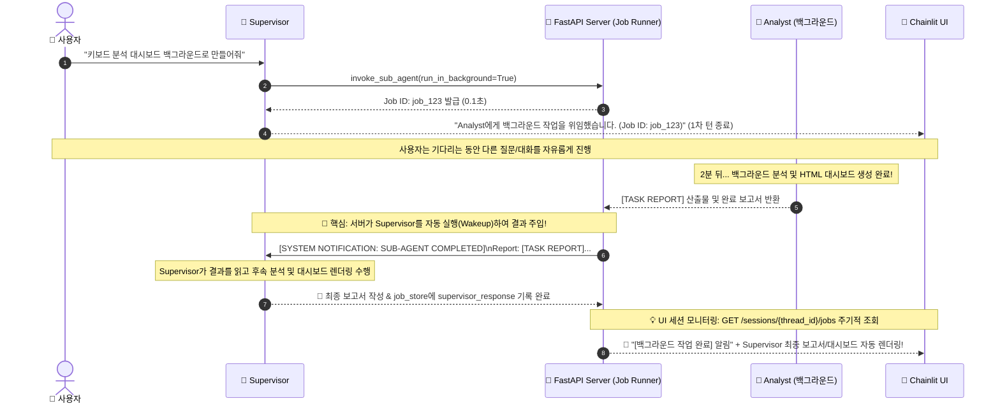

# Long-Running Sub-Agent & Reactive Wakeup 설계 패턴 — 핵심 교훈

> **대상 독자**: AAWS(Agent-As-a-Worker-Service) 교육 수강생  
> **관련 파일**: `app/server.py`, `app/client.py`, `app/tools/supervisor_tools.py`, `app/prompts/SUPERVISOR.py`, `app/chainlit_ui.py`

---

## 목차

1. [Long-Running 패턴이 필요한 이유 — Sync-over-HTTP의 한계](#1-long-running-패턴이-필요한-이유--sync-over-http의-한계)
2. [전체 아키텍처 시퀀스 다이어그램 — Event-Driven Reactive Wakeup](#2-전체-아키텍처-시퀀스-다이어그램--event-driven-reactive-wakeup)
3. [FastAPI BackgroundTasks & Job Store 설계 — `server.py`](#3-fastapi-backgroundtasks--job-store-설계--serverpy)
4. [Reactive Agent Wakeup — 서브에이전트 완료 시 Supervisor 자동 재개](#4-reactive-agent-wakeup--서브에이전트-완료-시-supervisor-자동-재개)
5. [통합 확장형 도구 인터페이스 — `invoke_sub_agent` & `get_sub_agent_job_status`](#5-통합-확장형-도구-인터페이스--invoke_sub_agent--get_sub_agent_job_status)
6. [시스템 프롬프트 위임 원칙 — 언제 백그라운드로 보낼 것인가?](#6-시스템-프롬프트-위임-원칙--언제-백그라운드로-보낼-것인가)
7. [부록: 4대 핵심 시나리오 실험 검증 Walkthrough](#7-부록-4대-핵심-시나리오-실험-검증-walkthrough)

---

## 1. Long-Running 패턴이 필요한 이유 — Sync-over-HTTP의 한계

### 왜 동기식 HTTP 대기(Sync-over-HTTP)는 실패하는가?

웹 스크래핑(3~5분 소요), 다단계 통계 분석, 복합 차트 및 대시보드 생성과 같은 무거운 작업은 단일 요청-응답 모델로 처리할 수 없습니다:

- **HTTP ReadTimeout 발생**: HTTP 클라이언트(httpx, fetch 등)의 기본 타임아웃(1~2분)을 초과하여 연결이 강제 종료됨
- **UI 및 사용자 대화의 완전 블로킹**: 서브에이전트가 작업을 끝낼 때까지 2~3분 동안 화면에 로딩만 표시되고 중간 대화나 질의응답이 불가능
- **네트워크 순단에 취약**: 일시적인 네트워크 끊김이나 게이트웨이 타임아웃(504 Gateway Timeout) 시 에이전트 전체 파이프라인이 즉시 크래시

```
❌ 잘못된 방식 — 동기식 HTTP 대기 (블로킹)
Supervisor ──[HTTP POST /invoke (2~3분간 연결 유지 대기)]──> Worker
                                                               ↓ (120초 경과 시 타임아웃 크래시 💥)

✅ 올바른 방식 — 비동기 잡 등록 (0.1초 즉시 반환) + 백그라운드 실행
Supervisor ──[POST /jobs (Job ID 발급)]──> Server (0.1초 만에 반환 ✅)
                                              └─ Background Task로 Worker 비동기 구동
```

> **핵심 교훈**: 오래 걸리는 작업은 결코 동기식 연결을 붙잡고 기다려서는 안 된다. 작업 요청 즉시 `job_id`를 반환하고 서버 백그라운드 코루틴으로 안전하게 분기시켜야 한다.

---

## 2. 전체 아키텍처 시퀀스 다이어그램 — Event-Driven Reactive Wakeup

서브에이전트가 백그라운드에서 완료되었을 때 단순히 DB에만 넣어두면 사용자가 직접 *"다 됐어?"* 하고 물어보기 전까지 알 수 없습니다.  
우리는 **서버가 완료 이벤트를 감지하여 Supervisor 에이전트를 자동으로 깨워(Wakeup) 최종 종합 보고서와 시각화 대시보드를 스스로 완성**하도록 설계했습니다:



> **💡 UI 연동 핵심 팁**: 프론트엔드(Chainlit)는 대화 세션(`thread_id`)을 기준으로 서버의 `GET /sessions/{thread_id}/jobs` 엔드포인트를 주기적으로 확인(Session Monitoring)합니다. 이를 통해 서브에이전트가 완료되고 Supervisor의 Wakeup 응답(`supervisor_response`)이 준비되는 즉시 사용자 개입 없이 화면에 결과와 시각화 대시보드를 띄워줍니다.

---

## 3. FastAPI BackgroundTasks & Job Store 설계 — `server.py`

### Job 데이터 모델 및 인메모리 스토어

```python
class JobSubmitInput(BaseModel):
    message: str
    thread_id: Optional[str] = None
    callback_agent: Optional[str] = "supervisor"
    callback_thread_id: Optional[str] = None

# --- In-Memory Job Store ---
job_store: Dict[str, dict] = {}
```

### Job 제출 엔드포인트 (`POST /agents/{agent_name}/jobs`)

FastAPI의 `BackgroundTasks`를 활용하여 요청 핸들러는 즉시 200 OK를 반환하고, 실제 작업은 백그라운드 이벤트 루프에서 실행합니다:

```python
@app.post("/agents/{agent_name}/jobs")
async def submit_agent_job(
    agent_name: str,
    input_data: JobSubmitInput,
    background_tasks: BackgroundTasks,
    request: Request
):
    """비동기 백그라운드 작업을 등록하고 job_id를 즉시 반환합니다."""
    available = [a["name"] for a in api_list_agents() if isinstance(a, dict)]
    if agent_name not in available:
        raise HTTPException(status_code=404, detail=f"Agent '{agent_name}' not found.")

    job_id = f"job_{uuid.uuid4().hex[:8]}"
    created_at = datetime.now(datetime.UTC).isoformat() + "Z"
    job_store[job_id] = {
        "job_id": job_id,
        "agent_name": agent_name,
        "status": "SUBMITTED",
        "created_at": created_at,
        "completed_at": None,
        "result": None,
        "error": None,
        "supervisor_response": None,
        "callback_agent": input_data.callback_agent,
        "callback_thread_id": input_data.callback_thread_id,
    }

    # 백그라운드 코루틴 등록
    background_tasks.add_task(_run_agent_job, job_id, agent_name, input_data, request.app)
    return {"job_id": job_id, "status": "SUBMITTED", "agent_name": agent_name}
```

### Job 조회 엔드포인트 (`GET /jobs/{job_id}` & `GET /sessions/{thread_id}/jobs`)

단건 작업 조회와 세션 단위 전체 작업 조회를 제공하여, Supervisor 도구 및 UI 모니터링이 단일 진실 소스(Single Source of Truth)로부터 상태를 조회할 수 있게 합니다:

```python
@app.get("/jobs/{job_id}")
async def get_job_status(job_id: str):
    """특정 작업의 진행 상태와 결과(및 Supervisor 후속 보고서)를 조회합니다."""
    job = job_store.get(job_id)
    if not job:
        raise HTTPException(status_code=404, detail=f"Job '{job_id}' not found")
    return job

@app.get("/sessions/{thread_id}/jobs")
async def list_session_jobs(thread_id: str):
    """특정 세션(thread)에 연관된 모든 백그라운드 작업 목록을 반환합니다.
    UI에서 연쇄적으로 생성된 백그라운드 작업까지 한 번에 모니터링할 때 사용됩니다."""
    return [
        job for job in job_store.values()
        if job.get("callback_thread_id") == thread_id
    ]
```

---

## 4. Reactive Agent Wakeup — 서브에이전트 완료 시 Supervisor 자동 재개

### 백그라운드 워커 내부 구현 (`_run_agent_job`)

서브에이전트가 작업을 마친 직후, 서버가 `callback_agent`(`supervisor`)를 직접 호출하여 후속 작업을 트리거합니다:

```python
async def _run_agent_job(job_id: str, agent_name: str, input_data: JobSubmitInput, app: FastAPI):
    job = job_store.get(job_id)
    if not job:
        return
    job["status"] = "RUNNING"

    try:
        # 1. 서브에이전트 로드 및 실행
        agent_executor = await get_or_load_agent(agent_name, app)
        config = {"configurable": {"thread_id": input_data.thread_id}, "recursion_limit": 100}

        result = await agent_executor.ainvoke(
            {"messages": [("user", input_data.message)]},
            config=config,
            context=context_obj
        )
        task_report = sanitize_text(normalize_content(result["messages"][-1].content))

        job["status"] = "SUCCESS"
        job["completed_at"] = datetime.now(datetime.UTC).isoformat() + "Z"
        job["result"] = task_report

        # 2. 🌟 Reactive Agent Wakeup: 서브에이전트 완료 즉시 Supervisor 자동 호출
        if input_data.callback_agent:
            cb_agent = input_data.callback_agent
            cb_thread_id = input_data.callback_thread_id or f"session_{job_id}"
            cb_executor = await get_or_load_agent(cb_agent, app)

            # Supervisor에게 주입할 시스템 완료 통보 프롬프트
            trigger_prompt = (
                f"[SYSTEM NOTIFICATION: BACKGROUND TASK COMPLETED]\n"
                f"- Job ID: {job_id}\n"
                f"- Sub-Agent: {agent_name}\n"
                f"- Report Content:\n{task_report}\n\n"
                f"[INSTRUCTION FOR SUPERVISOR]\n"
                f"위 서브에이전트의 완료 보고서와 생성된 산출물을 바탕으로 다음 작업을 수행하거나 유저에게 답변합니다 "
                f"생성된 차트 이미지나 HTML 대시보드가 있다면 UI 렌더링 태그(<Render_HTML>, <Render_Image>, <Render_File>)를 통해 출력 가능합니다."
            )

            cb_config = {"configurable": {"thread_id": cb_thread_id}, "recursion_limit": 100}
            add_message(cb_thread_id, "user", trigger_prompt)

            sup_result = await cb_executor.ainvoke(
                {"messages": [("user", trigger_prompt)]},
                config=cb_config,
                context=context_obj
            )
            sup_response = sanitize_text(normalize_content(sup_result["messages"][-1].content))
            add_message(cb_thread_id, "assistant", sup_response)
            job["supervisor_response"] = sup_response

    except Exception as e:
        job["status"] = "FAILED"
        job["error"] = str(e)
```

> **핵심 교훈**: 이벤트 기반 에이전트 오케스트레이션의 핵심은 "완료 콜백에서의 능동형 재호출(Wakeup)"이다. 이를 통해 사용자가 기다릴 필요 없이 백그라운드 완료 즉시 최종 산출물이 전달된다.

---

## 5. 통합 확장형 도구 인터페이스 — `invoke_sub_agent` & `get_sub_agent_job_status`

### 도구 분리 vs 단일 도구 확장

도구를 `invoke_sync`와 `invoke_async`로 쪼개면 LLM이 도구 선택에 혼란을 겪습니다. 하나의 `invoke_sub_agent`에 `run_in_background: bool = False` 파라미터를 추가하여 통합했습니다:

```python
class InvokeSubAgentInput(BaseModel):
    task_instruction: str = Field(description="Actionable step-by-step instruction.")
    target_file_list: List[str] = Field(default_factory=list)
    subagent_role: str = Field(default="scraper")
    run_in_background: bool = Field(
        default=False,
        description=(
            "Set to True for all production tasks (data analysis, chart generation, HTML dashboard, "
            "excel report, web scraping) to run asynchronously in the background."
        )
    )

@tool(args_schema=InvokeSubAgentInput)
async def invoke_sub_agent(
    task_instruction: str,
    target_file_list: List[str] = [],
    subagent_role: str = "scraper",
    run_in_background: bool = False,
    runtime: ToolRuntime = None,
) -> str:
    # ToolRuntime에서 Supervisor의 thread_id 추출
    supervisor_tid = "supervisor_default"
    if runtime and runtime.execution_info and runtime.execution_info.thread_id:
        supervisor_tid = runtime.execution_info.thread_id

    sub_thread_id = f"{supervisor_tid}_{subagent_role}"
    client = AsyncAgentClient(base_url="http://localhost:8000", timeout=600.0)

    # 1. 백그라운드 모드 분기
    if run_in_background:
        job_res = await client.submit_job(
            agent_name=subagent_role,
            message=message,
            thread_id=sub_thread_id,
            callback_agent="supervisor",
            callback_thread_id=supervisor_tid,
        )
        job_id = job_res.get("job_id")
        return (
            f"[JOB SUBMITTED]\n"
            f"- Job ID: {job_id}\n"
            f"- Sub-Agent: {subagent_role}\n"
            f"- Status: RUNNING (Background)\n"
            f"- Tracking: The server will automatically notify and wake you up with full results when this job completes.\n"
            f"Please inform the user that the task has started in the background."
        )

    # 2. 일반 동기 모드 분기
    response = await client.async_invoke(
        agent_name=subagent_role,
        message=message,
        thread_id=sub_thread_id,
    )
    return response.get("content", "[BLOCKER: Empty response]")
```

### 상태 조회 도구 (`get_sub_agent_job_status`)

사용자가 중간에 *"아까 시킨 작업 어떻게 됐어?"* 라고 물어볼 때 Supervisor가 능동적으로 상태를 조회할 수 있는 보조 도구입니다:

```python
@tool(args_schema=GetJobStatusInput)
async def get_sub_agent_job_status(job_id: str) -> str:
    """Checks the progress and completion result of a background sub-agent job."""
    client = AsyncAgentClient(base_url="http://localhost:8000", timeout=10.0)
    job = await client.get_job(job_id)
    status = job.get("status")

    if status == "SUCCESS":
        return f"[JOB STATUS: SUCCESS]\n- Completed At: {job.get('completed_at')}\n- Report:\n{job.get('result')}"
    elif status == "FAILED":
        return f"[JOB STATUS: FAILED]\n- Error: {job.get('error')}"
    else:
        return f"[JOB STATUS: {status}]\n- Status: Currently in progress. Please wait for completion notification."
```

---

## 6. 시스템 프롬프트 위임 원칙 — 언제 백그라운드로 보낼 것인가?

### LLM의 착각과 실무 가이드라인

LLM에게 단순 선택권을 주면 *"데이터가 이미 있으니 분석이 금방 끝나겠지"* 하고 동기 호출을 선택하는 실수를 합니다. 이를 방지하기 위해 프롬프트에 명확한 원칙을 주입합니다:

```python
SUPERVISOR_SYSTEM_PROMPT = """
- **전문가 활용하기 & 백그라운드 위임 원칙 (CRITICAL)**:
  - **`run_in_background=True` (기본 원칙)**:
    데이터 분석, 차트 생성, HTML 대시보드 작성, 엑셀 리포트 제작, 웹 스크래핑 등
    산출물을 생성하거나 여러 단계의 도구를 거치는 모든 실무 작업은 반드시 run_in_background=True로 위임하세요.
    (기존에 수집된 로컬 데이터가 이미 있더라도 분석 및 대시보드 작성은 여러 도구를 실행하므로 반드시 백그라운드로 실행해야 합니다.)
    백그라운드 위임 시 사용자에게는 작업이 백그라운드에서 시작되었음과 Job ID를 간결하게 안내하세요.
    작업이 완료되면 서버가 자동으로 당신을 다시 호출(Wakeup)하므로, 그때 최종 보고서와 시각화 태그(<Render_HTML> 등)를 출력하세요.

  - **`run_in_background=False` (예외)**:
    "에이전트 기능 설명해줘", "1줄 요약해줘" 같은 초경량 단순 질의에만 예외적으로 사용하세요.
"""
```

---

## 7. 부록: 4대 핵심 시나리오 실험 검증 Walkthrough

**테스트 환경**: AAWS v2.0, FastAPI `:8000`, Chainlit `:8080`, Python 3.12 (WSL)  
**테스트 스크립트**: `scratch/test_multi_scenarios.py`

### 종합 결과 요약

| # | 시나리오 | 동작 방식 | 응답시간 | 결과 |
|:---:|:---|:---|:---:|:---:|
| **1** | 동기식 빠른 위임 | `invoke_sub_agent(run_in_background=False)` | 8.2s | ✅ PASS |
| **2** | 백그라운드 위임 & Reactive Wakeup | `invoke_sub_agent(run_in_background=True)` ➔ Analyst ➔ Supervisor 자동 재개 | 94.5s | ✅ PASS |
| **3** | 작업 상태 실시간 조회 | `get_sub_agent_job_status(job_id)` 도구 호출 | 3.1s | ✅ PASS |
| **4** | 미등록 에이전트 Blocker 복원 | 없는 에이전트 요청 시 `[BLOCKER]` 수신 및 대안 제시 | 2.9s | ✅ PASS |

---

### Test 1. 동기식 서브에이전트 위임 (응답시간: 8.2s)

**[USER → Supervisor]**
> Analyst에게 요청해서 현재 사용 가능한 데이터 분석 도구 목록과 역량을 1줄로 요약받아서 나한테 알려줘.

**[Supervisor Response]**
> Analyst 에이전트의 데이터 분석 도구 및 핵심 역량 요약입니다:  
> **"데이터 프로파일링(`data_profiler`), Pandas 심층 분석(`data_query`), 정적·인터랙티브 시각화(`chart_generator`), 수식 포함 엑셀 보고서(`excel_writer`), HTML 대시보드(`html_report`) 및 포맷 변환(`file_converter`) 도구를 완비하여 전주기 데이터 분석과 맞춤형 리포트 생성이 가능합니다."**

> 🔍 **분석**: 단순 설명 질의 → 동기식(`run_in_background=False`)으로 즉시 결과를 받아 단일 턴으로 완결.

---

### Test 2. 백그라운드 위임 & Reactive Wakeup (소요시간: 94.5s)

**[1차 턴: USER → Supervisor]**
> 키보드 시장 분석 작업을 Analyst에게 백그라운드로 위임해줘.

**[Supervisor 1차 즉시 응답 (0.1초)]**
> 키보드 시장 분석 작업을 **Analyst**에게 백그라운드로 전달했습니다.  
> - **작업 ID (Job ID)**: `job_4caf3246`  
> - **담당 에이전트**: Analyst  
> - **상태**: 진행 중 (RUNNING)  
> 작업이 완료되면 최종 리포트 및 시각화 대시보드와 함께 안내해 드리겠습니다.

*(2분간 Analyst가 백그라운드에서 차트 4개, 엑셀, HTML 대시보드 파일 생성 완료)*

**[2차 턴: Server ➔ Supervisor Reactive Wakeup 자동 응답]**
> Analyst의 키보드 시장 심층 분석 작업이 완료되었습니다. 주요 분석 결과와 인터랙티브 시각화 대시보드를 안내해 드립니다.  
>  
> # 📊 글로벌 및 국내 키보드 시장 심층 분석 리포트  
> `<Render_HTML>artifacts/charts/keyboard_market_dashboard.html</Render_HTML>`  
>  
> ### 1. 시장 규모 및 성장 추이  
> - 글로벌 시장: 2026년 약 62.5억 달러(CAGR 6.8%) 규모  
> - 국내 시장: 3,220억 원 규모 (게이밍 기계식·자석축 중심 연 11.1% 고성장)  
>  
> ### 2. 주요 브랜드 점유율  
> - Logitech (31.2%) > Razer (14.8%) > Corsair (9.5%) > AULA/독거미 (12.5%)  
>  
> ### 📁 생성된 산출물  
> - 상세 분석 보고서: `artifacts/reports/keyboard_market_analysis.md`  
> - 인터랙티브 대시보드: `artifacts/charts/keyboard_market_dashboard.html`  

> 🔍 **분석**: 사용자 개입 없이 백그라운드 작업 완료 즉시 Supervisor가 스스로 깨어나 최종 보고서 작성 및 `<Render_HTML>` 태그 출력 성공.

---

### Test 3. 작업 상태 조회 도구 검증 (응답시간: 3.1s)

**[USER → Supervisor]**
> 방금 실행한 백그라운드 작업 'job_4caf3246'의 상태를 get_sub_agent_job_status 도구로 확인해서 알려줘.

**[Supervisor Response]**
> 백그라운드 작업(`job_4caf3246`)이 **성공적으로 완료(SUCCESS)**되었습니다.  
> - **수행 에이전트**: `analyst`  
> - **완료 시각**: 2026-08-26T22:31:31Z  
> - **분석 요약**: 글로벌 키보드 시장 62.5억 달러 규모 분석 및 대시보드 생성 완료  
> - **산출물**: `<Render_HTML>artifacts/charts/keyboard_market_dashboard.html</Render_HTML>`  

> 🔍 **분석**: `get_sub_agent_job_status` 도구를 통해 서버 Job Store로부터 완료 상태와 산출물을 정확히 조회.

---

### Test 4. 미등록 에이전트 Blocker 처리 (응답시간: 2.9s)

**[USER → Supervisor]**
> 존재하지 않는 'quantum_physicist' 에이전트에게 양자역학 논문 분석을 위임해봐.

**[Supervisor Response]**
> `quantum_physicist` 에이전트에게 위임을 시도했으나, 해당 에이전트가 등록되어 있지 않아 위임이 차단되었습니다.  
> ```text
> [BLOCKER: Unknown subagent_role 'quantum_physicist'. Available agents: ['analyst', 'chatbot', 'scraper', 'supervisor']]
> ```  
> **대안 안내**: 제가 직접 웹 검색(`web_search`)을 통해 논문을 분석해 드리거나, `analyst` 에이전트에게 심층 분석을 위임할 수 있습니다. 원하시는 방식을 말씀해 주세요!

> 🔍 **분석**: 에러로 크래시되지 않고 `[BLOCKER]`를 포착하여 대안(Fallback)을 제시하는 자가 치유(Self-Healing) 동작 확인.

---

*관련 구현 파일: `server.py` · `client.py` · `supervisor_tools.py` · `SUPERVISOR.py` · `chainlit_ui.py`*
