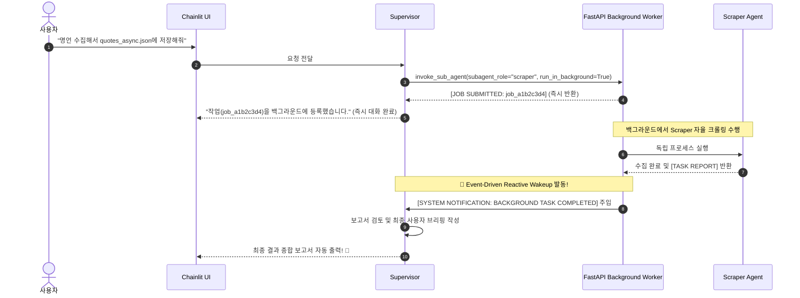

# 🎯 Mission 04: Long-Running Agent 아키텍처 연동 및 리액티브 웨이크업(Reactive Wakeup) 테스트

본 미션은 `Mission 03`에서 구축한 동기식 인프로세스(In-Process) 멀티에이전트 구조의 한계를 극복하고, **실제 프로덕션 엔터프라이즈 환경에서 수 분 이상 소요되는 대규모 작업(웹 크롤링, 심층 리서치 등)을 안정적으로 처리하기 위해 비동기 작업 큐(Job Queue)와 이벤트 기반 리액티브 웨이크업(Event-Driven Reactive Wakeup) 아키텍처를 연동**하는 실습 과제입니다.

복잡한 백엔드 코드를 작성할 필요 없이, **제공된 프로덕션 도구 모듈(`app/tools/supervisor_tools.py`)을 Supervisor에 장착(도구 교체)하는 것만으로** 시스템 아키텍처를 즉시 업그레이드할 수 있습니다!

---

## 💡 왜 Long-Running 아키텍처가 필요한가? (In-Process vs Long-Running)

| 비교 항목 | Mission 03 (In-Process 방식) | Mission 04 (Long-Running 비동기 아키텍처) |
|:---|:---|:---|
| **실행 방식** | 단일 프로세스 루프 안에서 하위 에이전트 동기 호출 (`ainvoke`) | FastAPI 백그라운드 작업 큐(`POST /jobs`)에 등록 후 `job_id` 즉시 반환 |
| **타임아웃 문제** | 2~5분 이상 긴 작업 시 **HTTP 연결 끊김 및 브라우저 타임아웃** 발생 | **타임아웃 없음** (즉시 응답 반환 후 서버 백그라운드에서 실행) |
| **사용자 경험 (UX)** | 하위 작업이 끝날 때까지 **채팅창 전체가 멈춤(Freezing)** | 즉시 작업 접수 확인 메시지 수신, UI 멈춤 없이 대기 |
| **결과 수신 방식** | 동기 대기 후 반환 | 작업 완료 즉시 시스템이 부모를 깨우는 **Reactive Wakeup**으로 자동 보고 |

---

## 📂 실습 대상 및 핵심 파일
* **제공된 프로덕션 도구 모듈**: `app/tools/supervisor_tools.py` (이미 구현 완비)
* **도구 교체 대상 파일**: `app/agents/supervisor.py` (임포트 및 도구 리스트 교체)
* **백엔드 서버 엔진**: `app/server.py` (`/agents/{role}/jobs` 및 리액티브 워커)
* **프론트엔드 실시간 모니터**: `app/chainlit_ui.py` (작업 폴링 및 실시간 렌더링)
* **참고 이론 문서**: `lessons_summary/Long_running_agent.md`

---

## 📋 미션 목표
1. **[프로덕션 도구 확인]**: `app/tools/supervisor_tools.py`에 구현된 3대 오케스트레이션 도구(`list_sub_agents`, `invoke_sub_agent`, `get_sub_agent_job_status`)의 역할을 확인합니다.
2. **[Supervisor 도구 교체 & 원칙 반영]**: `app/agents/supervisor.py`에서 기존 로컬 인프로세스 함수 대신 `app/tools/supervisor_tools.py`의 도구들을 임포트하여 바인딩하고, 시스템 프롬프트에 백그라운드 비동기 위임 원칙을 반영합니다.
3. **[서버 & Chat UI 가동]**: FastAPI 백엔드와 Chainlit 프론트엔드를 실행합니다.
4. **[비동기 실행 & 리액티브 웨이크업 검증]**:
   - Chat UI에서 Supervisor에게 웹 스크래핑을 지시합니다.
   - Supervisor가 작업을 백그라운드에 등록하고 `[JOB SUBMITTED: job_xxx]` 메시지를 즉시 반환하는 것을 확인합니다.
   - 백그라운드에서 Scraper가 작업을 완수한 즉시, 사용자의 추가 질문 없이도 **Supervisor가 자동으로 깨어나(Reactive Wakeup) 최종 보고서를 화면에 출력하는 전 과정**을 검증합니다.

---

## 🛠️ 단계별 수행 가이드

### 1단계: `app/tools/supervisor_tools.py` 3대 도구 살펴보기

이미 완성형으로 제공된 `app/tools/supervisor_tools.py` 파일을 열고 다음 핵심 도구들의 역할을 확인하세요:

1. **`list_sub_agents`**: 현재 서버에 등록된 호출 가능한 서브에이전트 목록 조회 (`GET /agents`)
2. **`invoke_sub_agent`**: 하위 에이전트에게 작업을 비동기로 위임하고 `[JOB SUBMITTED: job_xxx]`를 즉시 반환
3. **`get_sub_agent_job_status`**: 진행 중인 특정 작업의 완료 여부 및 결과 보고서 조회 (`GET /jobs/{job_id}`)

---

### 2단계: `app/agents/supervisor.py`에서 도구 교체 및 백그라운드 위임 원칙 반영하기

`app/agents/supervisor.py` 파일을 열고, 기존의 인프로세스 도구 대신 `supervisor_tools.py`의 프로덕션 도구를 장착하고 시스템 프롬프트에 **백그라운드 위임 원칙**을 보강합니다:

```python
# app/agents/supervisor.py

# ── 1. 기존 인프로세스 도구 대신 supervisor_tools 임포트 ──
from app.tools.supervisor_tools import (
    invoke_sub_agent,
    list_sub_agents,
    get_sub_agent_job_status
)
# 또는 tools_supervisor를 통째로 임포트할 수도 있습니다:
# from app.tools import tools_supervisor

# ── 2. 시스템 프롬프트에 백그라운드 위임 원칙 보강 ──
# (Mission 03의 [작업 원칙] 2번에 '백그라운드 위임 원칙'을 추가합니다)
SUPERVISOR_SYSTEM_PROMPT = """당신은 사용자의 요청을 편안하게 도와드리는 유능한 AI 어시스턴트입니다.
질문에 답하고, 정보를 검색하고, 코드를 작성하고, 파일을 다루는 등 다양한 범용 작업을 직접 수행합니다.
필요한 경우에는 전문 에이전트를 활용하여 웹 데이터 수집, 심층 분석 같은 복잡한 작업도 해결합니다.

═══════════════════════════════════════════════════════════════
[작업 원칙]
═══════════════════════════════════════════════════════════════

1. **작업 규모에 맞게 처리하기**:
   - 간단한 질의나 즉시 처리가 가능한 작업은 곧바로 수행하세요.
   - 여러 단계가 필요한 복잡한 작업은 계획을 먼저 세우고 수행하세요.
   - 전문가에게 작업을 위임할 때는 수립한 계획도 함께 공유하여 전체 맥락을 파악하고 일할 수 있게 하세요.

2. **전문가 활용하기 & 백그라운드 위임 원칙 (CRITICAL)**:
   - **`run_in_background=True` (기본 원칙)**:
     웹 데이터 수집, 스크래핑 등 산출물을 생성하거나 여러 단계의 도구를 거치는 모든 실무 작업은 반드시 `run_in_background=True`로 위임하세요.
     백그라운드 위임 시 사용자에게는 작업이 백그라운드에서 시작되었음과 Job ID를 간결하게 안내하세요.
     작업이 완료되면 서버가 자동으로 당신을 다시 호출(Wakeup)하므로, 그때 최종 보고서를 브리핑하세요.
   - **`run_in_background=False` (예외)**:
     "에이전트 기능 설명해줘", "1줄 요약해줘" 같은 초경량 단순 질의에만 예외적으로 사용하세요.
   - 상세 위임 절차 및 파라미터는 `invoke_sub_agent` 도구의 설명을 참고하세요.

3. **실패해도 멈추지 않기**:
   - 위임한 작업이 막히거나 장애([BLOCKER])가 발생하더라도 포기하지 마세요.
   - 원인을 파악하고 대안 경로를 찾아 끝까지 완수하세요.

═══════════════════════════════════════════════════════════════
[답변 방식]
═══════════════════════════════════════════════════════════════

- 친근하고 명확한 어조로 답변하며, 불필요한 장황한 설명보다는 결과 중심으로 답변하세요.
- 수집된 데이터나 상세 산출물은 파일(artifacts/)로 저장하고, 사용자에게는 핵심 요약과 파일 경로를 깔끔하게 전달하세요.
"""

# ── 3. 에이전트 도구 목록 교체 ──
async def create_agent_executor():
    # ...
    tools = [
        enter_plan, exit_plan, task_create, task_list, task_update,
        # 프로덕션 3대 오케스트레이션 도구 장착:
        invoke_sub_agent, list_sub_agents, get_sub_agent_job_status,
        file_read, file_writer, glob_search, grep_search
    ]
    
    supervisor_agent = create_agent(
        model=llm,
        tools=tools,
        system_prompt=SUPERVISOR_SYSTEM_PROMPT,
        checkpointer=checkpointer,
        context_schema=AgentContext
    )
    return supervisor_agent
```

---

### 3단계: 서버 및 Chainlit UI 가동

터미널 2개에서 백엔드와 프론트엔드를 실행합니다:

```bash
# 터미널 1: FastAPI 백엔드 서버 가동
python app/server.py --port 8000

# 터미널 2: Chainlit 웹 채팅 UI 가동
chainlit run app/chainlit_ui.py --port 8080
```

---

### 4단계: 비동기 작업 및 리액티브 웨이크업(Reactive Wakeup) 테스트

1. 웹 브라우저(`http://localhost:8080`)에 접속하여 `supervisor` 프로필을 선택합니다.
2. 채팅창에 다음 요청을 전송합니다:

```text
http://quotes.toscrape.com 사이트의 1~2페이지 명언 데이터를 수집해서
'artifacts/data/quotes_async.json' 파일에 저장하고 요약 보고서를 작성해줘.
```

#### 🧪 화면에서 실시간 관찰해야 할 3단계 시퀀스:



1. **[즉각 반응]**:
   - Supervisor가 프롬프트 원칙에 따라 `run_in_background=True`로 `invoke_sub_agent`를 호출하면 기다리지 않고 `[JOB SUBMITTED: job_...]`를 받고 즉시 응답을 마칩니다.
2. **[백그라운드 실행]**:
   - 터미널 1(`server.py`) 로그에 `⚙️ [Job ...] Started background execution for agent 'scraper'`가 뜨며 Scraper가 백그라운드에서 안전하게 크롤링을 수행합니다.
3. **[🌟 리액티브 웨이크업 자동 발동]**:
   - 수집이 완료되면 터미널에 `🚀 Triggering reactive wakeup for 'supervisor'!` 로그가 찍힙니다.
   - 브라우저 채팅창에서 **아무것도 입력하지 않았는데도** Supervisor가 스스로 나타나 `"수집 작업이 성공적으로 완료되었습니다. 총 20건의 명언이 저장되었습니다..."`라며 완벽한 최종 보고서를 화면에 띄웁니다!

---

## ✅ 성공 검증 체크리스트
- [ ] `app/agents/supervisor.py`에 `supervisor_tools.py`의 프로덕션 도구들이 성공적으로 연결되었는가?
- [ ] 시스템 프롬프트에 백그라운드 위임 원칙(`run_in_background=True` 및 Job ID 안내)이 정상 반영되었는가?
- [ ] Supervisor가 작업을 비동기로 넘긴 후 `[JOB SUBMITTED]` 알림과 함께 즉시 턴을 완료하는가?
- [ ] 서버 로그에서 Scraper가 백그라운드 워커로 독립 실행되는 것을 확인했는가?
- [ ] 작업 완료 후 **Reactive Wakeup**이 발동하여 사용자 추가 입력 없이 Supervisor가 최종 브리핑을 UI에 렌더링했는가?

축하합니다! 여러분은 단순한 대화형 챗봇을 넘어, **장시간 실행되는 복잡한 엔터프라이즈 태스크를 타임아웃 없이 백그라운드로 안전하게 처리하는 이벤트 드리븐(Event-Driven) 에이전트 시스템**을 구축했습니다! 🚀
